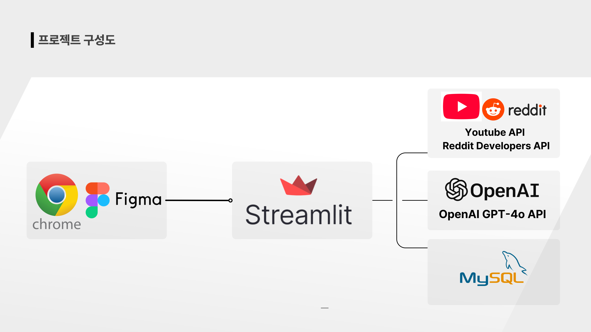
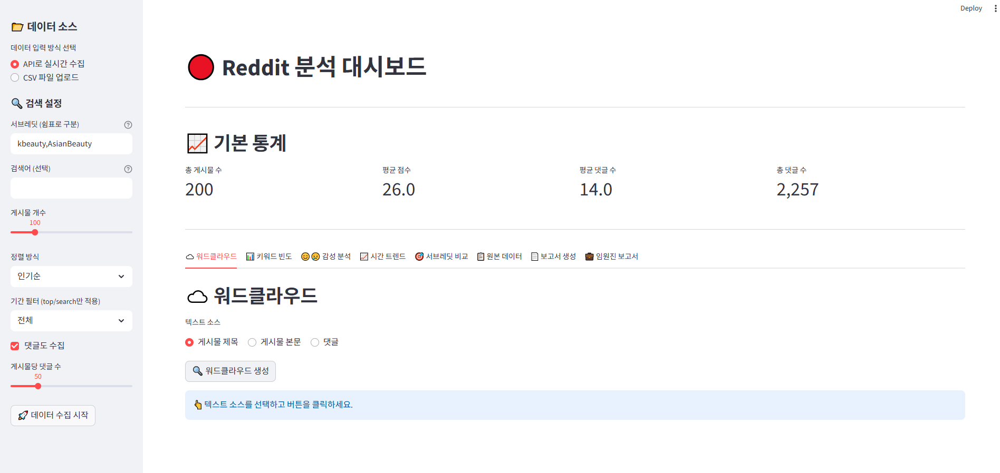

# 프로젝트 수행방향
## 1. 역할분담

## 2. 개발 일정

# 프로젝트 설계
## 1. 프로젝트 구성도

## 2. 설계 프로그램 상세

# 주요 기능
## global dashboard(reddit, youtube)

### 데이터 수집 및 관리
1. 실시간 데이터 수집
    - PRAW 라이브러리를 사용해 reddit api에 연결 / Google api client 라이브러리를 사용해 youtube data api v3에 연결
    - 사용자가 입력한 여러 서브레딧, 특정 검색어, 정렬 방식, 기간 필터를 기준으로 게시물과 댓글 수집
2. 데이터 로드: 로컬의 csv파일을 업로드하여 분석하는 기능 포함
3. 수집/저장 자동화
    - @st.cache_data를 적용하여 동일한 조건으로 <데이터 수집 시작>버튼을 눌러도 api를 중복 호출하지 않고 캐시된 데이터를 사용
    - 최종 수집시, 원본데이터를 reddit(youtube)_posts_raw_{timestamp}.csv 형식으로 analysis_results 폴더에 자동으로 1회 저장하여 원본 데이터를 보존

### 주요 분석 기능
- 워드클라우드&키워드 빈도: 게시물 제목, 본문, 댓글 텍스트를 각각 선택하여 불용어를 제거한 후 가장 많이 언급된 핵심 키워드 시각화 후 빈도수 계산
- 감성 분석: 미리 정의된 '감성사전'을 기반으로, 각 텍스트의 감성을 '긍정', '부정', '중립'으로 분류하고 전체 비율을 파이 차트로 시각화
- 시간 트렌드: Pandas의 resample 기능을 사용해, 일별/주별/월별로 게시글 수와 총 점수의 변화 추이를 꺾은선 그래프로 분석
- 서브레딧 비교: groupby를 활용해 여러 서브레딧의 평균점수, 총점수, 게시물수, 평균 댓글 수 를 집계하여 어느 채널이 가장 영향력 있는지 막대그래프로 비교
- 동시출현 분석: 핵심 키워드들이 하나의 댓글 안에서 '함께' 언급된 빈도를 계산하여, 단어 간의 연관성을 히트맵(Heatmap)으로 시각화. (예: '세럼'과 '가격'의 연관성)
- 토픽 비교: groupby 기능을 활용해 '영상 제목'별로 댓글을 그룹화하고, 각 영상의 Top 5 핵심 키워드를 추출하여 테이블로 비교.

### AI 보고서 기능 (OpenAI)
- 파일 필터링: 보고서 생성 시 analysis_results 폴더 내의 reddit_으로 시작하는 파일만 필터링하여 목록에 표시.
- 일반 보고서: 사용자가 분석 주제(Prompt)를 입력하면, 선택된 분석 CSV 파일들의 요약본과 프롬프트를 조합하여 항목별 상세 인사이트를 AI가 생성.
- 임원진 보고서: 사용자가 핵심 주제(Prompt)를 입력하면, AI가 모든 데이터를 요약하여 국문/영문으로 분리된 Executive Summary를 생성.

# 핵심 기술

